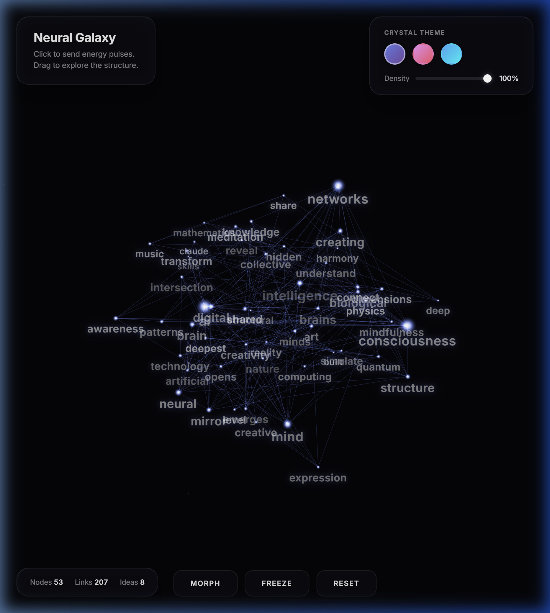
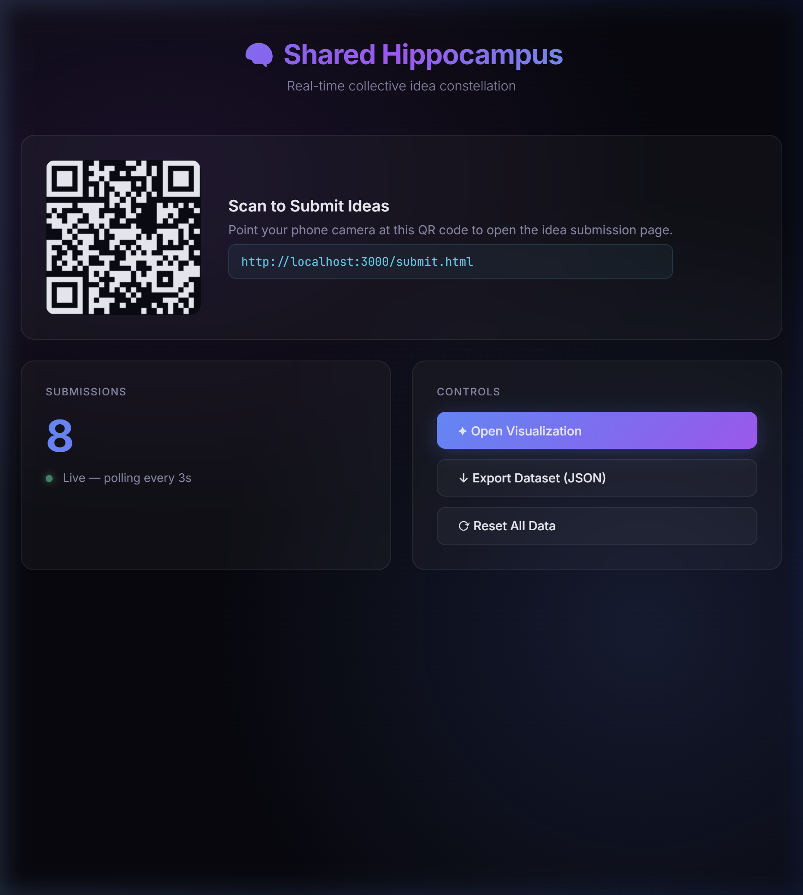
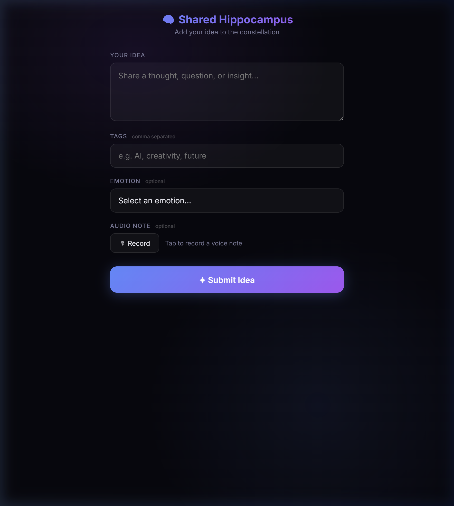

<p align="center">
  
</p>

<h1 align="center">🧠 Shared Hippocampus</h1>

<p align="center">
  <strong>A real-time collective idea constellation — gather thoughts from an audience, extract keywords, and project them as a living 3D neural galaxy.</strong>
</p>

<p align="center">
  <a href="https://shared-hippocampus.onrender.com"></a>
</p>

---

## ✦ What Is This?

Shared Hippocampus is an interactive installation tool designed for workshops, lectures,
and creative sessions. Participants submit ideas from their phones, and the system
extracts keywords, builds a co-occurrence graph, and renders the result as a
**3D neural galaxy** you can project on a screen.

The name references the hippocampus — the brain region responsible for forming new
memories — reimagined as a shared, collective structure.

---

## 🎨 Screenshots

<table>
  <tr>
    <td align="center"><strong>3D Neural Galaxy</strong></td>
    <td align="center"><strong>Host Dashboard</strong></td>
    <td align="center"><strong>Mobile Submission</strong></td>
  </tr>
  <tr>
    <td></td>
    <td></td>
    <td></td>
  </tr>
</table>

---

## ⚡ Features

### 3D Visualization (`/visualize.html`)
- **Three.js** point cloud rendered with custom GLSL shaders
- **Drag** to orbit around the neural galaxy in 3D
- **Click** anywhere to send energy pulses through connections
- **Morph** transitions nodes between organic cluster ↔ perfect sphere
- **Freeze** pauses all animation; **Reset** returns camera to default
- **3 crystal themes** — Purple, Pink, Azure Blue
- **Density slider** controls connection visibility (20–100 %)
- **Weight-based scaling** — popular topics glow brighter and appear larger
- **2,000 background stars** with additive blending
- **Floating keyword labels** that track nodes in 3D space
- **Auto-rotate** and breathing pulse animation for ambient projection

### Host Dashboard (`/`)
- Live submission counter (polls every 3 s)
- QR code for easy audience access
- One-click export dataset to JSON
- Reset all data

### Mobile Submission (`/submit.html`)
- Responsive, touch-friendly glassmorphic form
- Text idea + comma-separated tags + emotion picker
- Optional audio note recording (WebRTC)
- Animated success overlay on submit

### Backend
- **Express.js** server with REST API
- Keyword extraction with stop-word filtering
- Co-occurrence graph builder with weighted nodes
- Works locally and on cloud platforms (Render, Glitch, etc.)

---

## 🚀 Quick Start

```bash
# Clone
git clone https://github.com/innercartography/shared-hippocampus.git
cd shared-hippocampus

# Install
npm install

# Run
npm start
```

Open [http://localhost:3000](http://localhost:3000) — that's it.

| Route | Purpose |
|-------|---------|
| `/` | Host dashboard with QR code |
| `/submit.html` | Mobile idea submission form |
| `/visualize.html` | 3D neural galaxy (project this fullscreen) |

---

## 🔌 API

| Method | Endpoint | Description |
|--------|----------|-------------|
| `POST` | `/api/submit` | Submit an idea `{ idea, tags, emotion }` |
| `GET` | `/api/data` | Get all raw submissions |
| `GET` | `/api/graph` | Get the computed node/link graph |
| `GET` | `/api/stats` | Get submission count |
| `GET` | `/api/info` | Get server URLs (submit, dashboard, viz) |
| `POST` | `/api/reset` | Clear all data |

---

## 🏗️ Architecture

```
shared-hippocampus/
├── server.js            # Express server + API routes
├── processor.js         # Keyword extraction + graph builder
├── index.html           # Host dashboard (QR, stats, controls)
├── submit.html          # Mobile idea submission form
├── visualize.html       # 3D visualization shell + glassmorphic UI
├── visualization.js     # Three.js scene, shaders, morph, pulses
├── data.json            # Persisted submissions
├── graph.json           # Computed graph (auto-rebuilt on submit)
└── package.json
```

### How the graph works

1. Each submitted idea is tokenized into keywords (stop words filtered)
2. Keywords that appear in the same idea form **co-occurrence links**
3. Node **weight** = mention count + 0.5 × connection count
4. Heavier nodes render larger and brighter in the visualization

---

## ☁️ Deploy

### Render (recommended)

1. Push to GitHub
2. Create a **Web Service** on [render.com](https://render.com)
3. Set **Build Command** → `npm install`
4. Set **Start Command** → `npm start`
5. Done — auto-deploys on every push to `main`

### Glitch

Import from GitHub — works out of the box (uses `process.env.PORT`).

---

## 🛠️ Tech Stack

| Layer | Technology |
|-------|-----------|
| Runtime | Node.js |
| Server | Express 4 |
| 3D Engine | Three.js (r128) via CDN |
| Shaders | Custom GLSL (vertex + fragment) |
| Orbit | Three.js OrbitControls |
| Font | [Inter](https://fonts.google.com/specimen/Inter) via Google Fonts |
| Styling | Vanilla CSS — glassmorphism, CSS variables |
| Deploy | Render / Glitch / any Node host |

---

## 📝 License

MIT

---

<p align="center">
  Built for collective thinking. ✦
</p>
